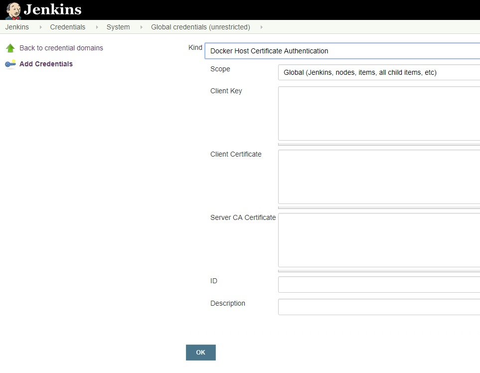

[prev: Docker Configuration](03_JenkinsConfiguration.md)

#   Jenkins Master Configuration
Configure the Jenkins master to connect to the docker daemon, start slave containers and run a build job.
  
##  Prepare Credentials
Check the credentials to access the docker daemon:
- Select `Credentials/Global credentials/Add Credentials`
  - Kind: `Docker Certificates Directory`
  - Description: `Docker Daemon TLS`
  - Path `/var/certs/localDockerDaemon`

  
##  Prepare the Jenkins Docker Plug In
Once Jenkins is started, the Docker plug in can be configured.

### Add Docker Cloud
Click `Manage Jenkins` and then `Configure System`.
At the bottom of the configuration page click `Add a new cloud` and select `Docker`.

### Connection to Docker API
Give your Docker cloud a name and add the Docker URL
(the IP of the host where the docker daemon exposes its REST API, e.g. `tcp://192.168.99.100:2376`).
With `Test Connection` you can verify that the Docker plug in can communicate with the Docker API.

### Add a New Docker Template
At images click `Add Docker Template` and select `Docker Template`.
Write `biz/jenkinsslave` in the text box `Docker Image` and define the Label with `biz-slave`.
Add new Cridentials of the Kind `Username with password` and at `Global` scope.
Use `jenkins` as username and password.

##  Create a New Job
At the main page of Jenkins select `create new jobs`, select `Freesyle project` and think out a nice name.
On the next page make sure that `Restrict where this project can be run` is checked and
select `biz-slave` as `Label Expression`.
In the section `Build` click `Add build step`, select `Execute shell` and
write a test command into the text box.
For example `echo "Hello BiZEPS"`.

##  Enjoy
Save your job configuration and execute the build with `Build Now`.
After the job has finished you can verify the build output with the `Console Output`.
For a successful build it would display an output like this:

Contgratulation, you just executed a build job on a Jenkins slave.
The Jenkins slave and the master are running in separate Docker containers.
The slaves container is active only during the build.
